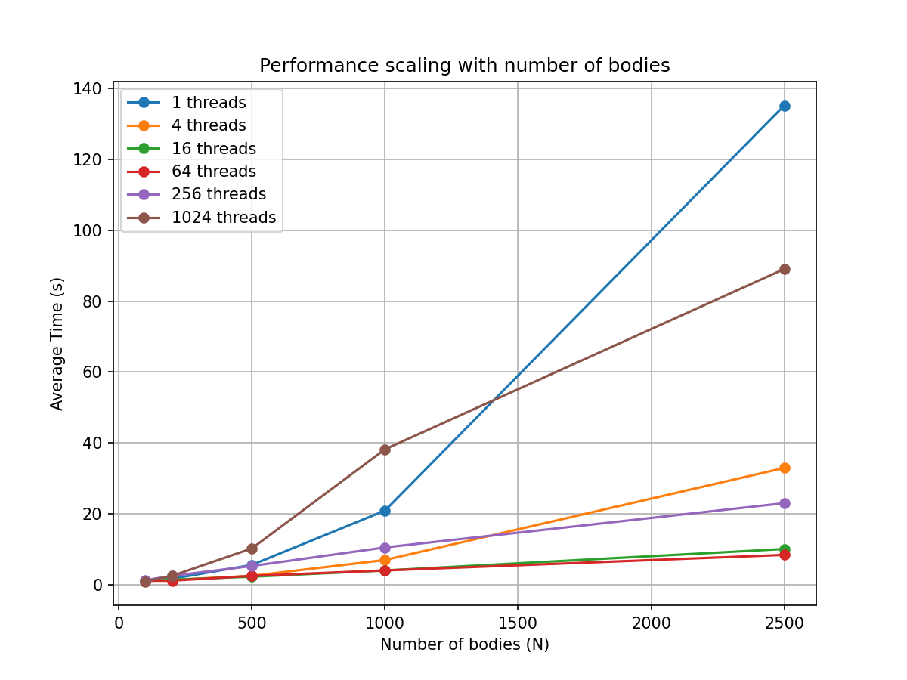
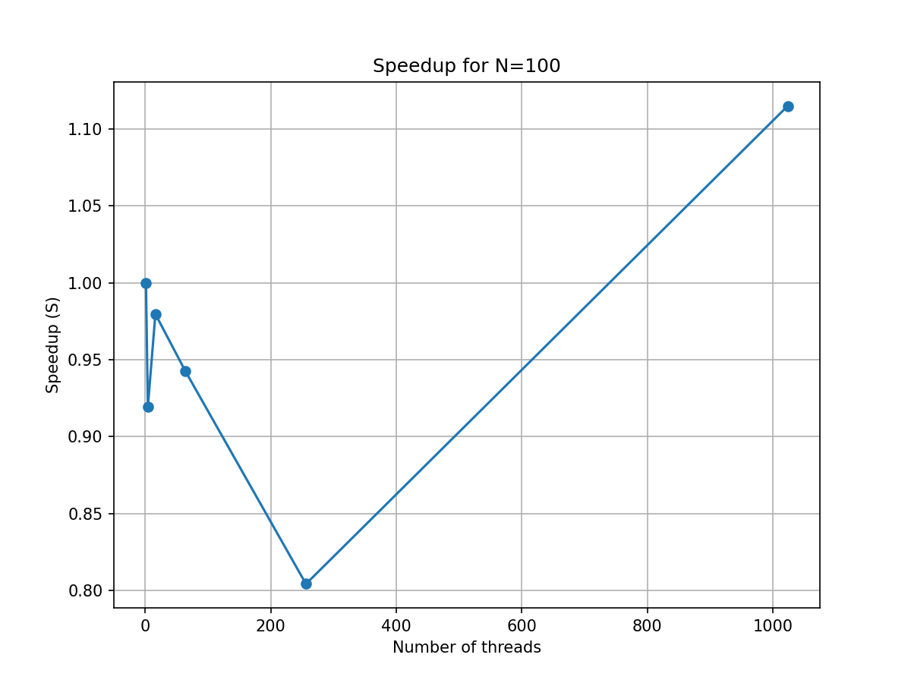
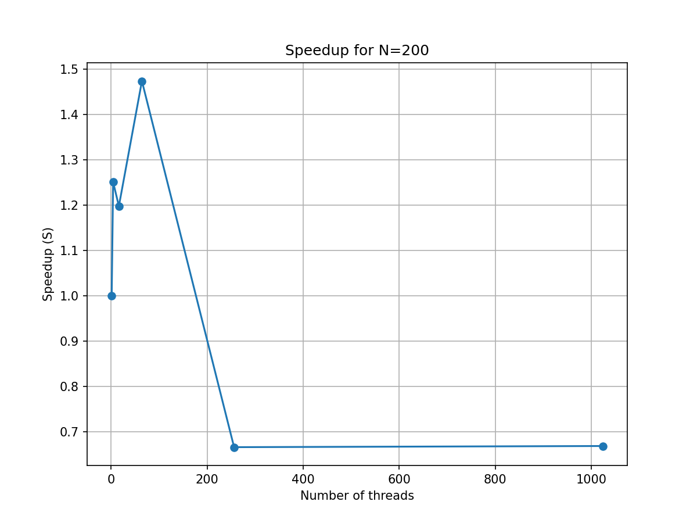
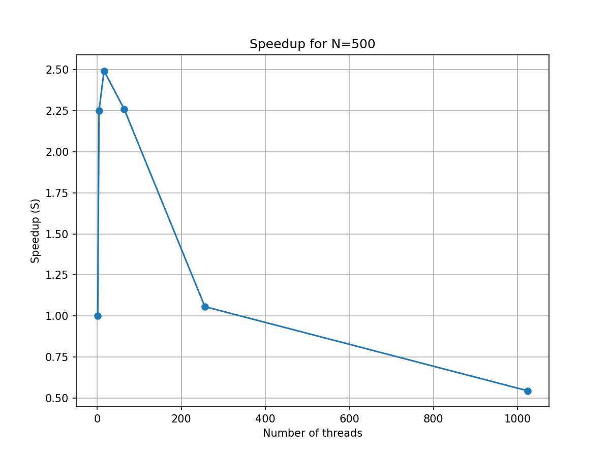
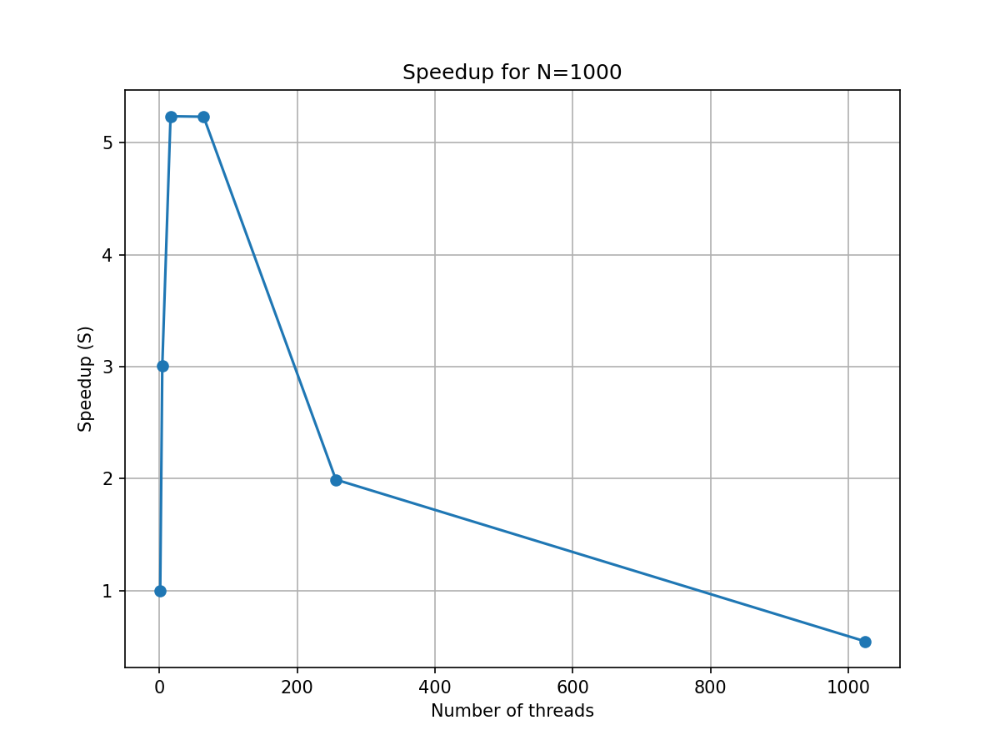
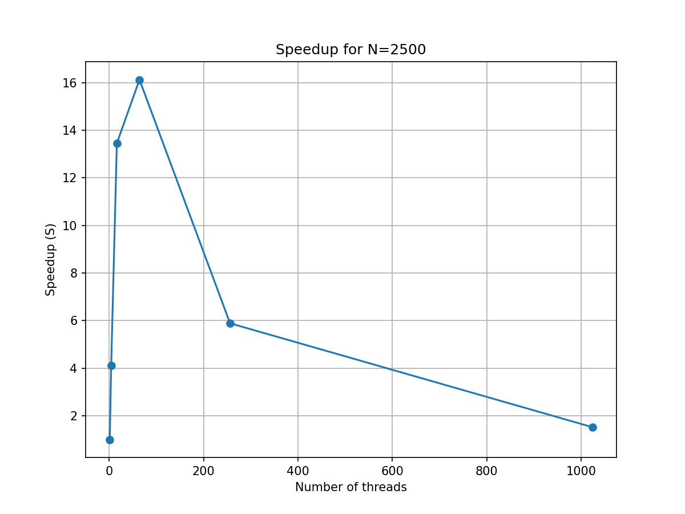

# Benchmark Results

## Summary
Below is a table of benchmark results measured by varying N and number of threads.

| N | Threads | avg_time_s | std_time_s |
|---|----------|------------|------------|
| 100 | 1 | 1.007998 | 0.043306 |
| 100 | 4 | 1.096547 | 0.110914 |
| 100 | 16 | 1.028906 | 0.029515 |
| 100 | 64 | 1.069608 | 0.044236 |
| 100 | 256 | 1.253528 | 0.043277 |
| 100 | 1024 | 0.903962 | 0.795323 |
| 200 | 1 | 1.639282 | 0.033119 |
| 200 | 4 | 1.310109 | 0.131136 |
| 200 | 16 | 1.368387 | 0.080124 |
| 200 | 64 | 1.112194 | 0.644499 |
| 200 | 256 | 2.459919 | 0.015813 |
| 200 | 1024 | 2.450586 | 0.004731 |
| 500 | 1 | 5.554516 | 0.685606 |
| 500 | 4 | 2.468916 | 0.681158 |
| 500 | 16 | 2.227573 | 0.050530 |
| 500 | 64 | 2.457606 | 0.063004 |
| 500 | 256 | 5.257438 | 0.673044 |
| 500 | 1024 | 10.207773 | 0.994128 |
| 1000 | 1 | 20.888789 | 1.087367 |
| 1000 | 4 | 6.944165 | 0.672143 |
| 1000 | 16 | 3.989313 | 0.648861 |
| 1000 | 64 | 3.992478 | 0.695289 |
| 1000 | 256 | 10.493351 | 0.786785 |
| 1000 | 1024 | 38.199254 | 0.759569 |
| 2500 | 1 | 135.281828 | 6.168467 |
| 2500 | 4 | 32.935098 | 4.983473 |
| 2500 | 16 | 10.055001 | 0.948547 |
| 2500 | 64 | 8.387596 | 0.983411 |
| 2500 | 256 | 22.987469 | 0.857043 |
| 2500 | 1024 | 89.108405 | 2.027698 |

## Time vs N

## Speedup for N=100

## Speedup for N=200

## Speedup for N=500

## Speedup for N=1000

## Speedup for N=2500

