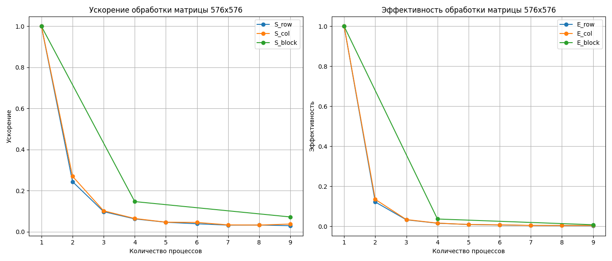
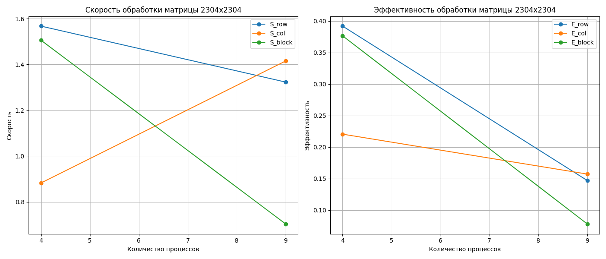
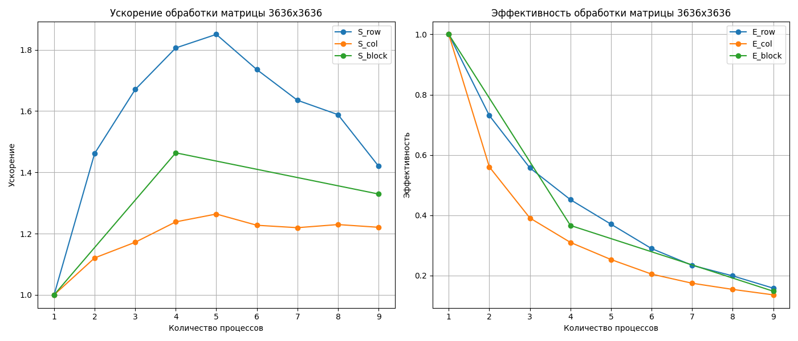

# Задание 1: Умножение матрицы на вектор

## Описание задания

Реализованы три варианта умножения матрицы на вектор:

1. Разбиение по строкам.  
2. Разбиение по столбцам.  
3. Разбиение на блоки.

## Численные эксперименты

Проведены эксперименты с различными размерами матрицы $A$ и вектора $x$, а также с разным количеством процессов $P$.  
Рассматриваемые размеры матрицы:  

- $576 \times 576$
- $2304 \times 2304$
- $3636 \times 3636$

Количество процессов:

- (1-9): для строкового и столбцового разбиения
- (1, 4, 9): для блочного разбиения

## Основные метрики параллельной реализации

Для оценки эффективности параллельной реализации используются следующие метрики:

- **Ускорение (S)**:

  $`
  S = \frac{T_{\text{послед}}}{T_{\text{паралл}}}
  `$

- **Эффективность (E)**:

  $`
  E = \frac{S}{nthreads}
  `$

## Результаты замеров времени  

### 576х576

|  Размер матрицы **A**  |  Количество процессов **P**  |  Разбиение по строкам (S, E)  |  Разбиение по столбцам (S, E)  |  Разбиение на блоки (S, E)  |
| :---: | :---: | :---: | :---: | :---: |
|  576x576  |  1  |  (1, 1)  |  (1, 1)  |  (1, 1)  |
|  576x576  |  2  |  (0.2438, 0.1219)  |  (0.2699, 0.1349)  |  ('-', '-')  |
|  576x576  |  3  |  (0.0978, 0.0326)  |  (0.1018, 0.0339)  |  ('-', '-')  |
|  576x576  |  4  |  (0.0625, 0.0156)  |  (0.0644, 0.0161)  |  (0.1468, 0.0367)  |
|  576x576  |  5  |  (0.0462, 0.0092)  |  (0.0466, 0.0093)  |  ('-', '-')  |
|  576x576  |  6  |  (0.0388, 0.0065)  |  (0.0453, 0.0076)  |  ('-', '-')  |
|  576x576  |  7  |  (0.0322, 0.0046)  |  (0.0333, 0.0048)  |  ('-', '-')  |
|  576x576  |  8  |  (0.0327, 0.0041)  |  (0.0325, 0.0041)  |  ('-', '-')  |
|  576x576  |  9  |  (0.0295, 0.0033)  |  (0.0374, 0.0042)  |  (0.072, 0.008)  |

### 2304х2304

|  Размер матрицы **A**  |  Количество процессов **P**  |  Разбиение по строкам (S, E)  |  Разбиение по столбцам (S, E)  |  Разбиение на блоки (S, E)  |
| :---: | :---: | :---: | :---: | :---: |
|  2304x2304  |  1  |  (1, 1)  |  (1, 1)  |  (1, 1)  |
|  2304x2304  |  2  |  (1.3662, 0.6831)  |  (1.2039, 0.6019)  |  ('-', '-')  |
|  2304x2304  |  3  |  (1.5147, 0.5049)  |  (1.2762, 0.4254)  |  ('-', '-')  |
|  2304x2304  |  4  |  (1.2654, 0.3164)  |  (1.1657, 0.2914)  |  (1.4136, 0.3534)  |
|  2304x2304  |  5  |  (0.9664, 0.1933)  |  (1.0805, 0.2161)  |  ('-', '-')  |
|  2304x2304  |  6  |  (0.8611, 0.1435)  |  (0.9364, 0.1561)  |  ('-', '-')  |
|  2304x2304  |  7  |  (0.7046, 0.1007)  |  (0.8898, 0.1271)  |  ('-', '-')  |
|  2304x2304  |  8  |  (0.7113, 0.0889)  |  (0.8497, 0.1062)  |  ('-', '-')  |
|  2304x2304  |  9  |  (0.5833, 0.0648)  |  (0.786, 0.0873)  |  (1.193, 0.1326)  |

### 3636х3636

|  Размер матрицы **A**  |  Количество процессов **P**  |  Разбиение по строкам (S, E)  |  Разбиение по столбцам (S, E)  |  Разбиение на блоки (S, E)  |
| :---: | :---: | :---: | :---: | :---: |
|  3636x3636  |  1  |  (1, 1)  |  (1, 1)  |  (1, 1)  |
|  3636x3636  |  2  |  (1.4616, 0.7308)  |  (1.1206, 0.5603)  |  ('-', '-')  |
|  3636x3636  |  3  |  (1.6704, 0.5568)  |  (1.1717, 0.3906)  |  ('-', '-')  |
|  3636x3636  |  4  |  (1.8061, 0.4515)  |  (1.2383, 0.3096)  |  (1.4637, 0.3659)  |
|  3636x3636  |  5  |  (1.8504, 0.3701)  |  (1.2639, 0.2528)  |  ('-', '-')  |
|  3636x3636  |  6  |  (1.7354, 0.2892)  |  (1.2272, 0.2045)  |  ('-', '-')  |
|  3636x3636  |  7  |  (1.6353, 0.2336)  |  (1.2193, 0.1742)  |  ('-', '-')  |
|  3636x3636  |  8  |  (1.5884, 0.1986)  |  (1.2295, 0.1537)  |  ('-', '-')  |
|  3636x3636  |  9  |  (1.4203, 0.1578)  |  (1.2206, 0.1356)  |  (1.3292, 0.1477)  |

## Выводы по заданию 1  

1. **Малые матрицы (576x576):** Параллелизация неэффективна из-за больших накладных расходов на синхронизацию и разделение памяти (высокий `overhead`). Ускорение и эффективность крайне низки для всех алгоритмов.

2. **Средние и крупные матрицы (2304x2304, 3636x3636):** 
   - Хорошие показатели ускорения достигаются при $P \leq 4$.
   - Блочное разбиение показывает лучшую производительность в целом, но из-за сложного разделения памяти, которое не может быть реализовано стандартными средствами MPI (например, `MPI_Scatterv`), получается очень большой `overhead`.

3. **Сравнение алгоритмов:** 
   - Строковое разбиение эффективнее столбцового, а на больших матрицах даже перегоняет блочное разбиение.
   - Блочное разбиение — наиболее масштабируемое и подходит для большинства матриц.
