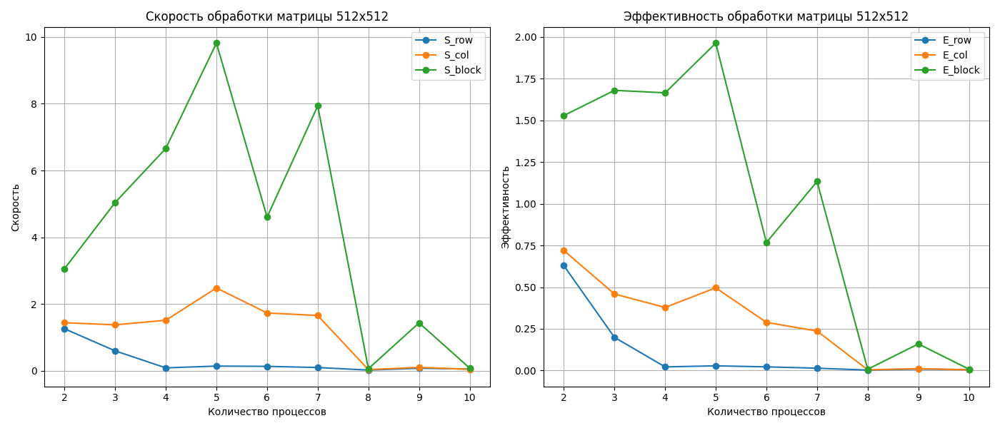
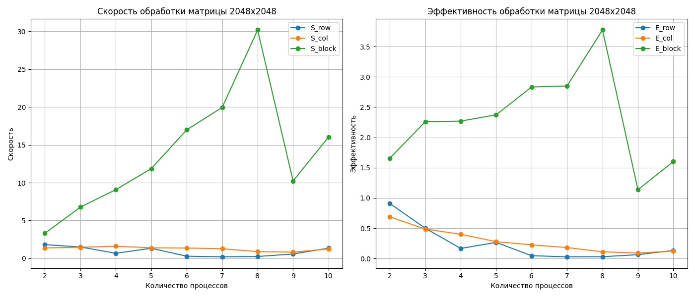
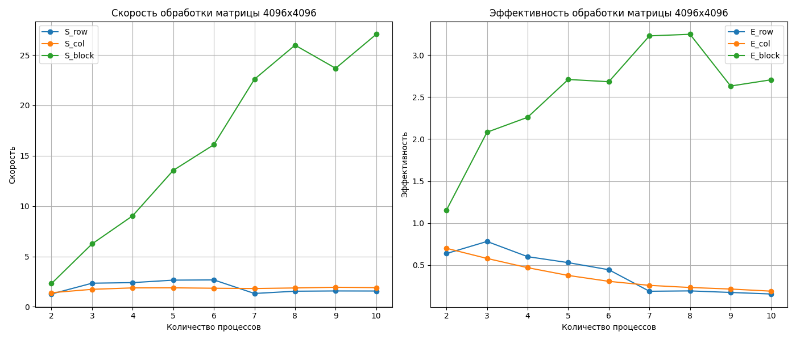

# Задание 1: Умножение матрицы на вектор

## Описание задания  
Реализованы три варианта умножения матрицы на вектор:  
1. Разбиение по строкам.  
2. Разбиение по столбцам.  
3. Разбиение на блоки.

## Численные эксперименты  
Проведены эксперименты с различными размерами матрицы $A$ и вектора $x$, а также с разным количеством процессов $P$.  
Рассматриваемые размеры матрицы:  
- $512 \times 512$, $2048 \times 2048$, $4096 \times 4096$.  
Количество процессов: 1--10.

## Основные метрики параллельной реализации

Для оценки эффективности параллельной реализации используются следующие метрики:
- **Ускорение (S)**:

  $`
  S = \frac{T_{\text{послед}}}{T_{\text{паралл}}}
  `$

- **Эффективность (E)**:

  $`
  E = \frac{S}{nthreads}
  `$

## Результаты замеров времени  

### 512x512

|  Размер матрицы **A**  |  Количество процессов **P**  |  Разбиение по строкам **(S, E)**  |  Разбиение по столбцам **(S, E)**  |  Разбиение на блоки **(S, E)**  |
| :---: | :---: | :---: | :---: | :---: |
|  512x512  |  1  |  ('-', '-')  |  ('-', '-')  |  ('-', '-')  |
|  512x512  |  2  |  (1.2582, 0.6291)  |  (1.4399, 0.7199)  |  (3.0574, 1.5287)  |
|  512x512  |  3  |  (0.5967, 0.1989)  |  (1.3765, 0.4588)  |  (5.0405, 1.6802)  |
|  512x512  |  4  |  (0.0869, 0.0217)  |  (1.5134, 0.3784)  |  (6.6607, 1.6652)  |
|  512x512  |  5  |  (0.1407, 0.0281)  |  (2.4802, 0.496)  |  (9.8158, 1.9632)  |
|  512x512  |  6  |  (0.132, 0.022)  |  (1.7323, 0.2887)  |  (4.6049, 0.7675)  |
|  512x512  |  7  |  (0.0977, 0.014)  |  (1.6559, 0.2366)  |  (7.9362, 1.1337)  |
|  512x512  |  8  |  (0.0205, 0.0026)  |  (0.034, 0.0043)  |  (0.0611, 0.0076)  |
|  512x512  |  9  |  (0.0763, 0.0085)  |  (0.1021, 0.0113)  |  (1.4346, 0.1594)  |
|  512x512  |  10  |  (0.0515, 0.0052)  |  (0.0428, 0.0043)  |  (0.0794, 0.0079)  |

### 2048x2048

|  Размер матрицы **A**  |  Количество процессов **P**  |  Разбиение по строкам **(S, E)**  |  Разбиение по столбцам **(S, E)**  |  Разбиение на блоки **(S, E)**  |
| :---: | :---: | :---: | :---: | :---: |
|  2048x2048  |  1  |  ('-', '-')  |  ('-', '-')  |  ('-', '-')  |
|  2048x2048  |  2  |  (1.8178, 0.9089)  |  (1.3787, 0.6894)  |  (3.3119, 1.656)  |
|  2048x2048  |  3  |  (1.5044, 0.5015)  |  (1.4628, 0.4876)  |  (6.7766, 2.2589)  |
|  2048x2048  |  4  |  (0.6684, 0.1671)  |  (1.6058, 0.4014)  |  (9.0779, 2.2695)  |
|  2048x2048  |  5  |  (1.3337, 0.2667)  |  (1.3941, 0.2788)  |  (11.8649, 2.373)  |
|  2048x2048  |  6  |  (0.2829, 0.0471)  |  (1.363, 0.2272)  |  (16.9925, 2.8321)  |
|  2048x2048  |  7  |  (0.2023, 0.0289)  |  (1.2728, 0.1818)  |  (19.9499, 2.85)  |
|  2048x2048  |  8  |  (0.2437, 0.0305)  |  (0.8948, 0.1119)  |  (30.192, 3.774)  |
|  2048x2048  |  9  |  (0.5782, 0.0642)  |  (0.8176, 0.0908)  |  (10.2315, 1.1368)  |
|  2048x2048  |  10  |  (1.3482, 0.1348)  |  (1.2464, 0.1246)  |  (16.0261, 1.6026)  |

### 4096x4096

|  Размер матрицы **A**  |  Количество процессов **P**  |  Разбиение по строкам (S, E)  |  Разбиение по столбцам (S, E)  |  Разбиение на блоки (S, E)  |
| :---: | :---: | :---: | :---: | :---: |
|  4096x4096  |  1  |  ('-', '-')  |  ('-', '-')  |  ('-', '-')  |
|  4096x4096  |  2  |  (1.2762, 0.6381)  |  (1.4017, 0.7008)  |  (2.3087, 1.1543)  |
|  4096x4096  |  3  |  (2.3462, 0.7821)  |  (1.7404, 0.5801)  |  (6.246, 2.082)  |
|  4096x4096  |  4  |  (2.4053, 0.6013)  |  (1.8811, 0.4703)  |  (9.0382, 2.2595)  |
|  4096x4096  |  5  |  (2.6508, 0.5302)  |  (1.8885, 0.3777)  |  (13.5472, 2.7094)  |
|  4096x4096  |  6  |  (2.6742, 0.4457)  |  (1.8465, 0.3078)  |  (16.0954, 2.6826)  |
|  4096x4096  |  7  |  (1.3274, 0.1896)  |  (1.8183, 0.2598)  |  (22.5954, 3.2279)  |
|  4096x4096  |  8  |  (1.5518, 0.194)  |  (1.8751, 0.2344)  |  (25.977, 3.2471)  |
|  4096x4096  |  9  |  (1.5782, 0.1754)  |  (1.944, 0.216)  |  (23.6814, 2.6313)  |
|  4096x4096  |  10  |  (1.5714, 0.1571)  |  (1.9076, 0.1908)  |  (27.0585, 2.7058)  |

## Выводы по заданию 1  

- Алгоритм с разбиением по строкам наиболее эффективен для небольших матриц.  
- Разбиение на блоки показывает преимущество при увеличении числа процессов и размеров данных.
