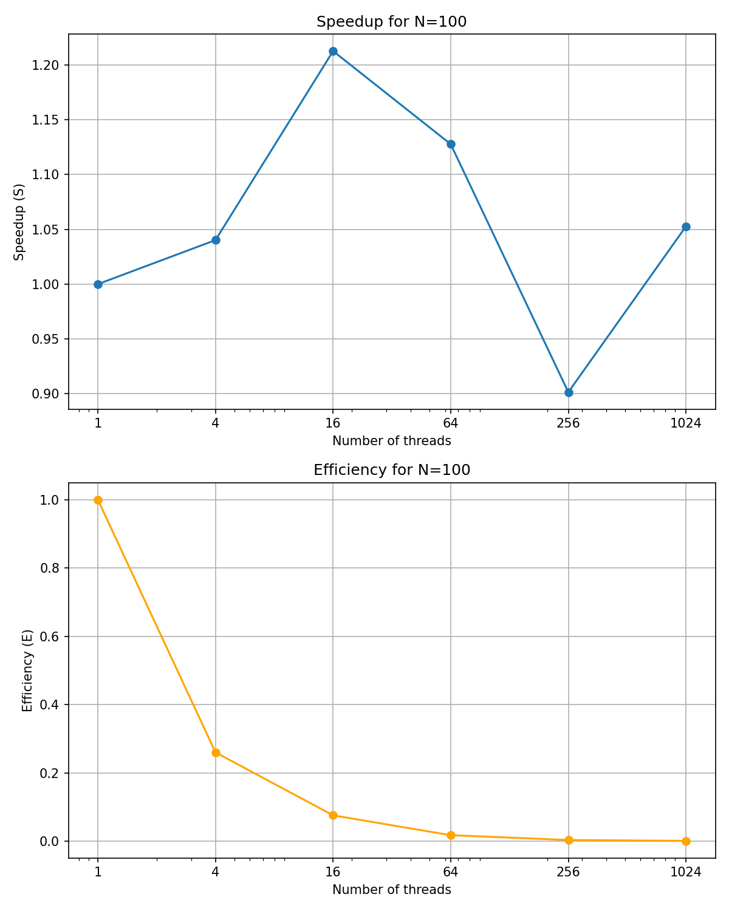
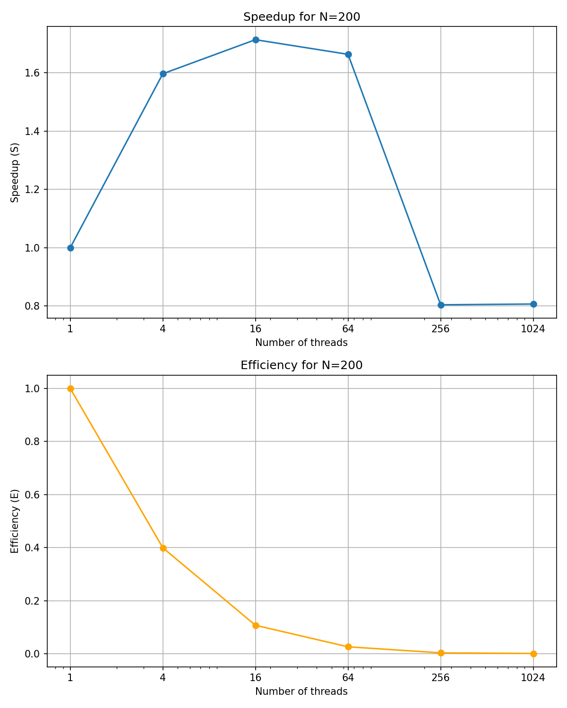
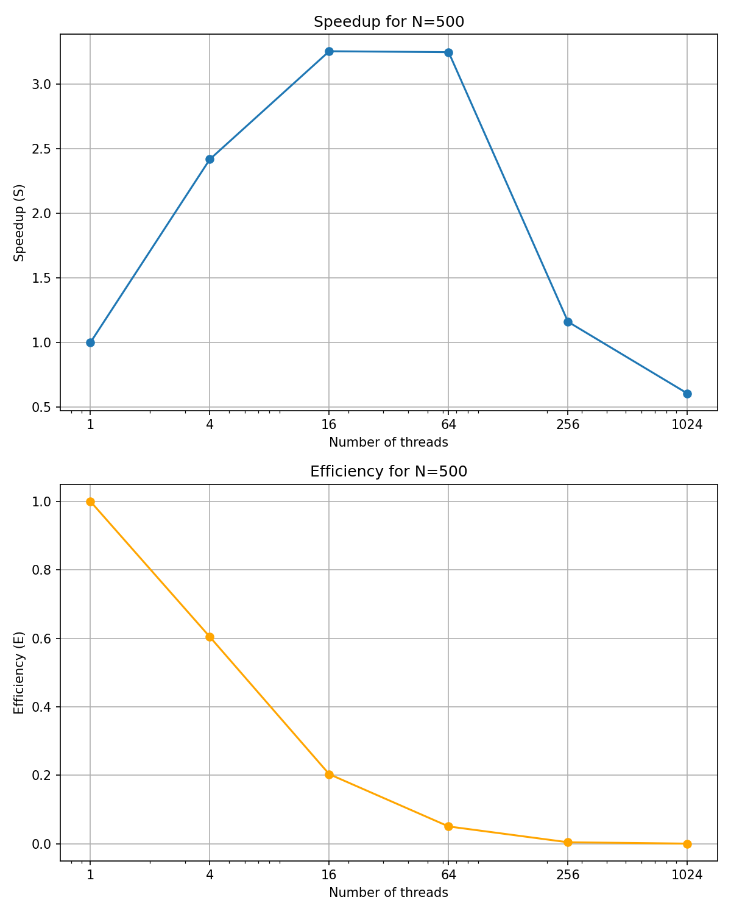
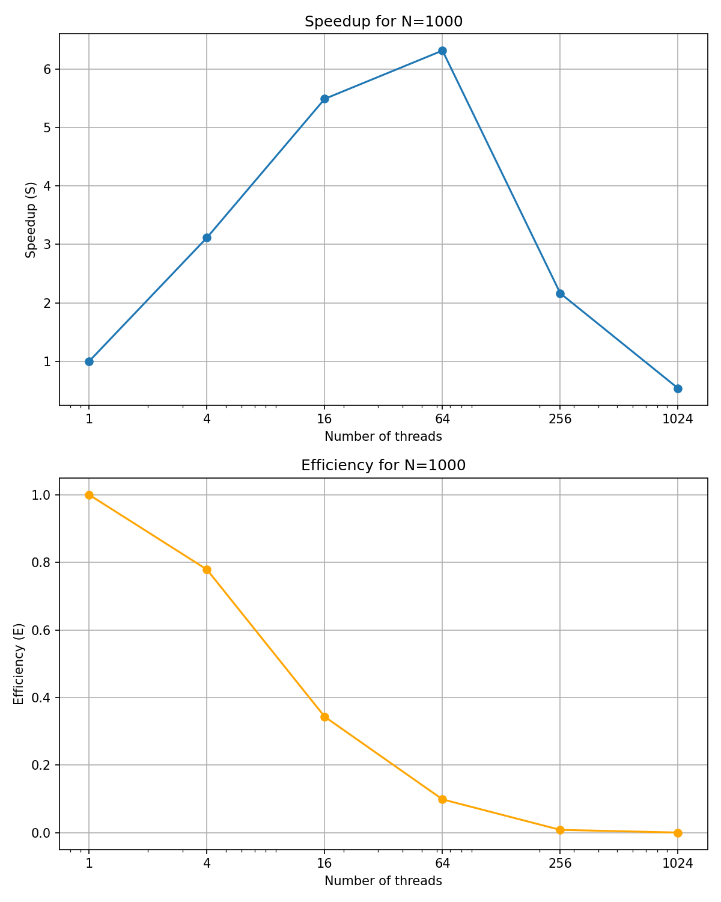

# Отчёт о результатах работы программы

## 1. Краткое описание задания

Целью эксперимента было замерить время выполнения алгоритма расчёта гравитационного взаимодействия между $N$ телами (например, для задачи $N$-тел) на CUDA. Для разных значений $N$ (числа тел) и при использовании различного числа потоков на GPU была замерена производительность (время вычисления), после чего было вычислено ускорение и эффективность относительно базового случая.

## 2. Формула ускорения

- **Ускорение ($)**:

$`
S = \frac{T_{\text{serial}}}{T_{\text{parallel}}}
`$

- **Эффективность (E)**:

$`
E = \frac{S}{nthreads}
`$

В данной работе за эталон (делитель) взято время выполнения при 1 потоке (`threads = 1`). Таким образом, `S = 1.0` соответствует отсутствию ускорения, значение больше 1.0 — ускорению, меньше 1.0 — замедлению относительно эталонного случая.

## 3. Результаты измерений

Ниже представлены результаты в табличном виде. Для каждой фиксированной размерности задачи ($N$) варьировалось число потоков (`threads`), и замерялось среднее общее время выполнения (`avg_time`) и CUDA (`avg_time_CUDA`), а также рассчитывалось ускорение ($S$) и эффективность ($E$).

### N=100

| N | threads | avg_time (s) | avg_time_CUDA (s) | Ускорение, S | Эффективность, E |
|---|----------|--------------|-------------------|--------------|-----------------|
| 100 | 1 | 0.824157 | 0.761159 | 1.00 | 1.0000 |
| 100 | 4 | 1.198300 | 0.731747 | 0.69 | 0.1719 |
| 100 | 16 | 1.045281 | 0.627669 | 0.79 | 0.0493 |
| 100 | 64 | 1.112423 | 0.674950 | 0.74 | 0.0116 |
| 100 | 256 | 1.308172 | 0.844417 | 0.63 | 0.0025 |
| 100 | 1024 | 1.066250 | 0.723075 | 0.77 | 0.0008 |

### N=200

| N | threads | avg_time (s) | avg_time_CUDA (s) | Ускорение, S | Эффективность, E |
|---|----------|--------------|-------------------|--------------|-----------------|
| 200 | 1 | 1.810326 | 1.445382 | 1.00 | 1.0000 |
| 200 | 4 | 1.266810 | 0.905034 | 1.43 | 0.3573 |
| 200 | 16 | 1.207356 | 0.843318 | 1.50 | 0.0937 |
| 200 | 64 | 0.976897 | 0.868765 | 1.85 | 0.0290 |
| 200 | 256 | 2.242612 | 1.797056 | 0.81 | 0.0032 |
| 200 | 1024 | 1.957762 | 1.791080 | 0.92 | 0.0009 |

### N=500

| N | threads | avg_time (s) | avg_time_CUDA (s) | Ускорение, S | Эффективность, E |
|---|----------|--------------|-------------------|--------------|-----------------|
| 500 | 1 | 5.999192 | 5.341478 | 1.00 | 1.0000 |
| 500 | 4 | 2.396298 | 2.209504 | 2.50 | 0.6259 |
| 500 | 16 | 2.058354 | 1.641650 | 2.91 | 0.1822 |
| 500 | 64 | 1.763023 | 1.645346 | 3.40 | 0.0532 |
| 500 | 256 | 4.956650 | 4.604084 | 1.21 | 0.0047 |
| 500 | 1024 | 9.390668 | 8.820112 | 0.64 | 0.0006 |

### N=1000

| N | threads | avg_time (s) | avg_time_CUDA (s) | Ускорение, S | Эффективность, E |
|---|----------|--------------|-------------------|--------------|-----------------|
| 1000 | 1 | 19.597340 | 19.085060 | 1.00 | 1.0000 |
| 1000 | 4 | 6.600096 | 6.126702 | 2.97 | 0.7423 |
| 1000 | 16 | 3.839868 | 3.475504 | 5.10 | 0.3190 |
| 1000 | 64 | 3.218494 | 3.020800 | 6.09 | 0.0951 |
| 1000 | 256 | 9.393068 | 8.822702 | 2.09 | 0.0081 |
| 1000 | 1024 | 36.292980 | 35.585300 | 0.54 | 0.0005 |

## 4. Общие графики производительности

### Время выполнения/GPU

## 5. Выводы

1. **Влияние масштаба задачи ($N$) на ускорение:**  
   Для малых значений $N$ (например, $N=100$) ускорение по сравнению с однопоточным вариантом либо отсутствует, либо минимально. Это связано с тем, что накладные расходы на подготовку GPU и передачу данных перевешивают выигрыш от параллелизации. Однако с ростом $N$ рост вычислительной нагрузки позволяет более эффективно использовать GPU. Так, при $N=500$ достигается ускорение до 3.4 раз (при 64 потоках), а при $N=1000$ — до 6.09 раз (также при 64 потоках).

2. **Оптимальное число потоков:**  
   Анализ результатов показывает, что для средних и больших размеров задачи максимальное ускорение достигается при относительно небольшом количестве потоков (от 16 до 64). Дальнейшее увеличение числа потоков приводит не к росту ускорения, а к его снижению. Основная причина — ограниченные аппаратные ресурсы GPU, ухудшение доступа к памяти и рост накладных расходов при слишком большом количестве потоков.

3. **Эффективность и её падение:**  
   Эффективность (отношение ускорения к числу потоков) значительно падает по мере увеличения числа потоков, особенно когда оно превышает оптимальный диапазон. Это указывает на то, что не всегда имеет смысл "распараллеливать" задачу до предела — слишком большое число потоков лишь увеличивает организационные потери без заметного прироста производительности.

4. **Малые задачи и накладные расходы:**  
   При небольших $N$ параллелизация не даёт существенного выигрыша из-за доминирования накладных расходов над чистым временем вычислений. По мере увеличения размера задачи доля затрат на инициализацию и передачу данных становится незначительной по сравнению с общим временем вычислений, что и даёт заметный рост ускорения.

В целом, оптимизация расчётов на GPU эффективна при достаточно больших размерах задачи и при разумном выборе числа потоков. При этом необходимо учитывать аппаратные ограничения GPU, структуру кода и распределение вычислительной нагрузки.
