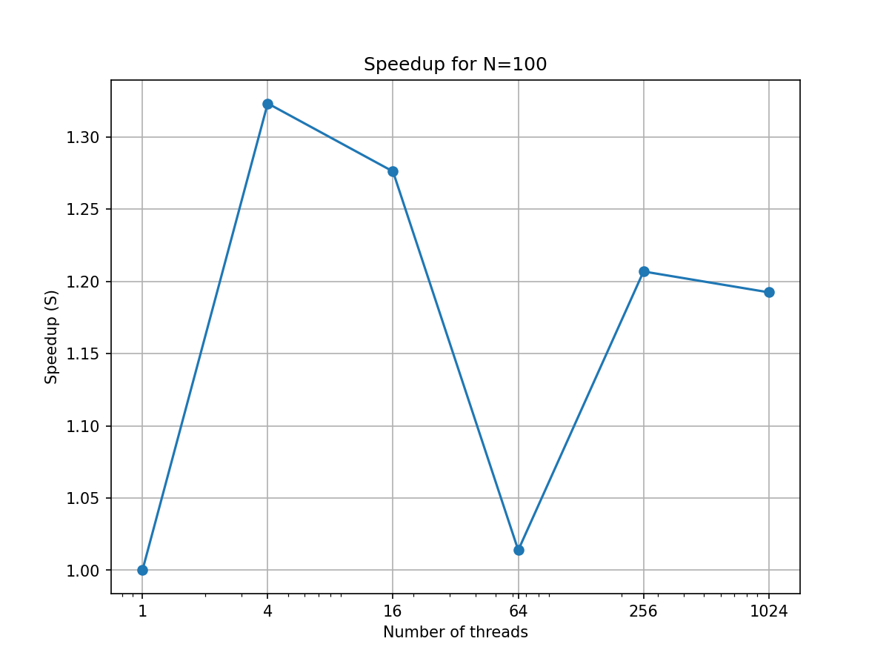
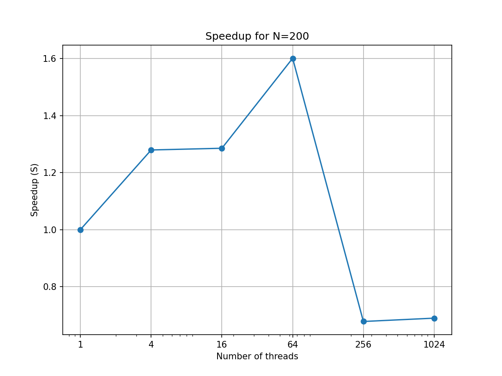
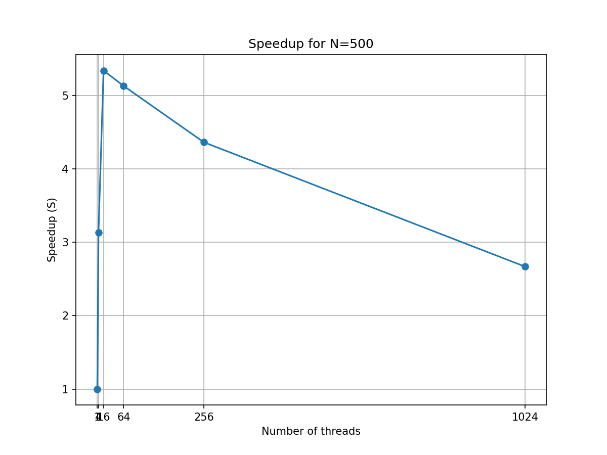
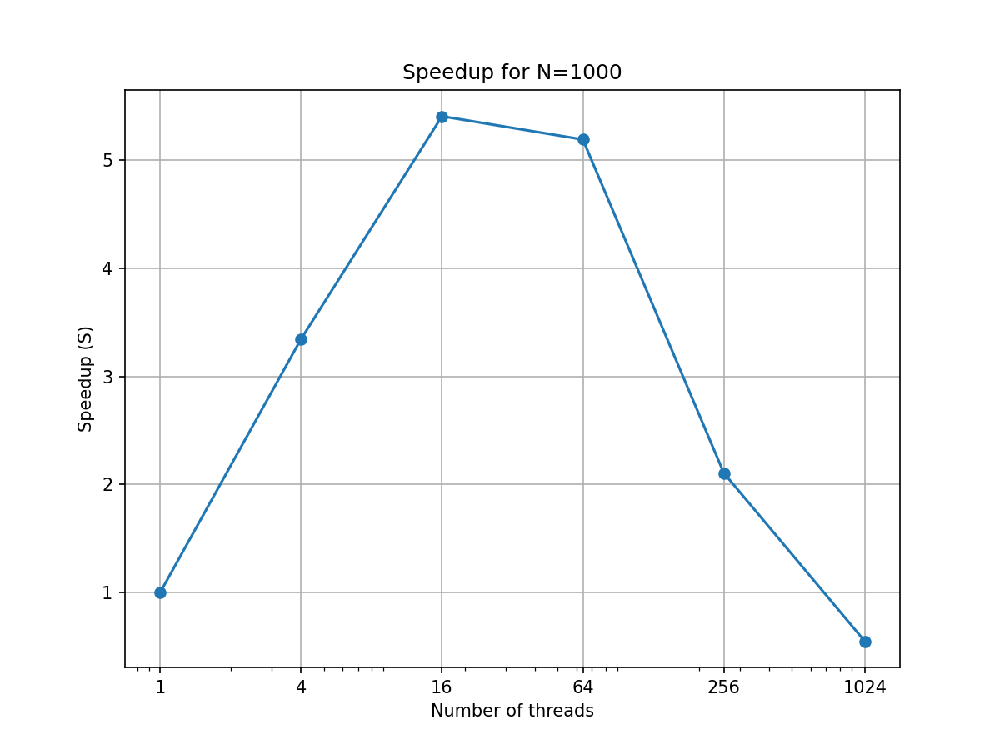
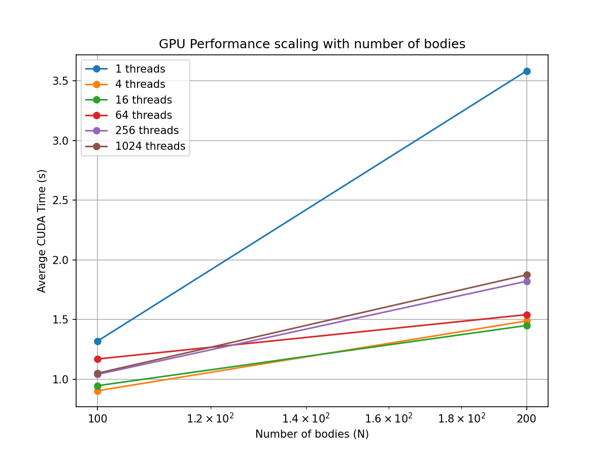

# Отчёт о результатах работы программы

## 1. Краткое описание задания

Целью эксперимента было замерить время выполнения алгоритма расчёта гравитационного взаимодействия между $N$ телами (например, для задачи $N$-тел) на CUDA. Для разных значений $N$ (числа тел) и при использовании различного числа потоков на GPU была замерена производительность (время вычисления), после чего было вычислено ускорение и эффективность относительно базового случая.

## 2. Формула ускорения

- **Ускорение ($)**:

$`
S = \frac{T_{\text{serial}}}{T_{\text{parallel}}}
`$

- **Эффективность (E)**:

$`
E = \frac{S}{nthreads}
`$

В данной работе за эталон (делитель) взято время выполнения при 1 потоке (`threads = 1`). Таким образом, `S = 1.0` соответствует отсутствию ускорения, значение больше 1.0 — ускорению, меньше 1.0 — замедлению относительно эталонного случая.

## 3. Результаты измерений

Ниже представлены результаты в табличном виде. Для каждой фиксированной размерности задачи ($N$) варьировалось число потоков (`threads`), и замерялось среднее общее время выполнения (`avg_time`) и CUDA (`avg_time_CUDA`), а также рассчитывалось ускорение ($S$) и эффективность ($E$).

### N=100

| N    | threads | avg_time_CPU (s) | avg_time_CUDA (s) | S |
|------|----------|-----------------|-------------------|-----------|
| 100  | 1    | 0.900075 | 0.596447 | 1.00 |
| 100  | 4    | 0.891023 | 0.578254 | 1.01 |
| 100  | 16   | 0.935385 | 0.595345 | 0.96 |
| 100  | 64   | 1.011757 | 0.644286 | 0.89 |
| 100  | 256  | 1.242994 | 0.827121 | 0.72 |
| 100  | 1024 | 1.182460 | 0.835759 | 0.76 |

### N=200

| N    | threads | avg_time_CPU (s) | avg_time_CUDA (s) | S |
|------|----------|-----------------|-------------------|-----------|
| 200  | 1    | 1.605920 | 1.222442 | 1.00 |
| 200  | 4    | 1.255144 | 0.835049 | 1.28 |
| 200  | 16   | 1.249268 | 0.853411 | 1.29 |
| 200  | 64   | 1.002846 | 0.925149 | 1.60 |
| 200  | 256  | 2.370934 | 1.948402 | 0.68 |
| 200  | 1024 | 2.330678 | 1.927340 | 0.69 |

### N=500

| N    | threads | avg_time_CPU (s) | avg_time_CUDA (s) | S |
|------|----------|-----------------|-------------------|-----------|
| 500  | 1    | 5.310118 | 4.965782 | 1.00 |
| 500  | 4    | 2.409914 | 2.148266 | 2.20 |
| 500  | 16   | 2.195180 | 1.704426 | 2.42 |
| 500  | 64   | 2.053314 | 1.837192 | 2.59 |
| 500  | 256  | 5.459412 | 4.823116 | 0.97 |
| 500  | 1024 | 11.696830| 10.936274| 0.45 |

### N=1000

| N     | threads | avg_time_CPU (s) | avg_time_CUDA (s) | S |
|-------|----------|-----------------|-------------------|-----------|
| 1000  | 1    | 25.199420 | 24.152080 | 1.00 |
| 1000  | 4    | 7.527878  | 6.881266  | 3.35 |
| 1000  | 16   | 4.659328  | 3.935952  | 5.41 |
| 1000  | 64   | 4.852420  | 3.974652  | 5.19 |
| 1000  | 256  | 11.963780 | 11.040060 | 2.11 |
| 1000  | 1024 | 45.966820 | 44.842180 | 0.55 |

### N=2500

| N     | threads | avg_time_CPU (s) | avg_time_CUDA (s) | S |
|-------|----------|-----------------|-------------------|-----------|
| 2500  | 1    | 158.726000 | 157.322000 | 1.00 |
| 2500  | 4    | 38.950800  | 37.373300  | 4.08 |
| 2500  | 16   | 12.502760  | 11.473060  | 12.70 |
| 2500  | 64   | 10.371454  | 9.372580   | 15.30 |
| 2500  | 256  | 28.812720  | 27.290440  | 5.51 |
| 2500  | 1024 | 113.108200 | 111.831000 | 1.40 |

## 4. Общие графики производительности

### Время выполнения/GPU

## 5. Выводы

- **Ускорение при разных масштабах задачи ($N$):**  
  Для малых значений $N$ ускорение практически отсутствует или незначительно. Это объясняется тем, что накладные расходы на передачу данных, инициализацию GPU-ресурсов и синхронизацию преобладают над выигрышем в параллелизации.
  
  По мере увеличения $N$ ситуация меняется: для средних и больших значений $N$ (например, $N=500$ или $N=1000$) наблюдается существенное ускорение при использовании оптимального числа потоков (16 или 64). Например, при $N=1000$ и 16 потоках ускорение достигает примерно 5.41 раз.

- **Почему просадка после 64 потоков?**  
  На графиках заметно, что после достижения некоторого оптимума (часто около 16 или 64 потоков) дальнейшее увеличение числа потоков не даёт дополнительного ускорения, а иногда даже снижает его. Причина в том, что увеличение числа потоков не всегда значит более эффективное использование ресурсов GPU. Может ухудшаться координация потоков, расти конкуренция за ресурсы памяти, что приводит к снижению эффективности.

- **Поведение на больших размерах задачи (N=2500):**  
  При $N=2500$ наблюдается очень существенное ускорение при 64 потоках (около 15.3 раз). Это говорит о том, что на больших N параллелизация эффективна, так как основная часть времени тратится на вычисления, которые хорошо масштабируются. Однако при ещё большем увеличении числа потоков (1024) ускорение падает, что снова указывает на уменьшение эффективности из-за перегрузки GPU или неравномерного распределения вычислительной нагрузки.

- **Причины слабого прироста на малых размерах задач:**  
  На маленьких $N$ вычислительная задача слишком мала, чтобы компенсировать затраты на инициализацию, передачу данных и синхронизации. В результате, GPU не успевает показать своё преимущество в параллелизме, так как сама задача «слишком проста».
