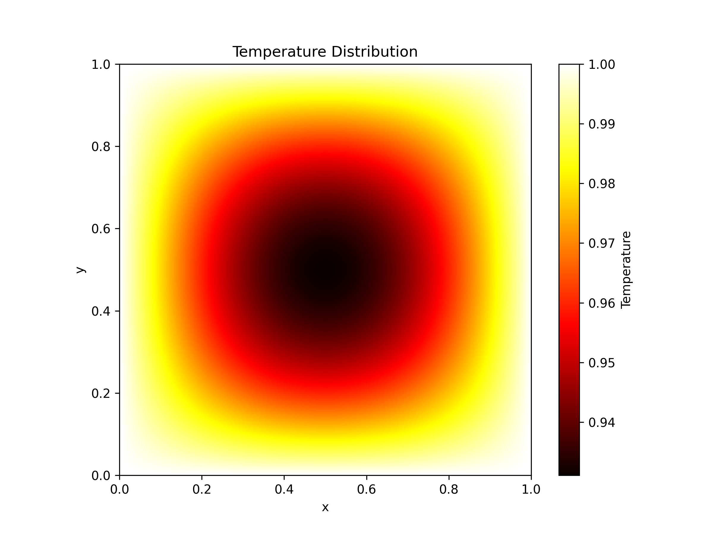
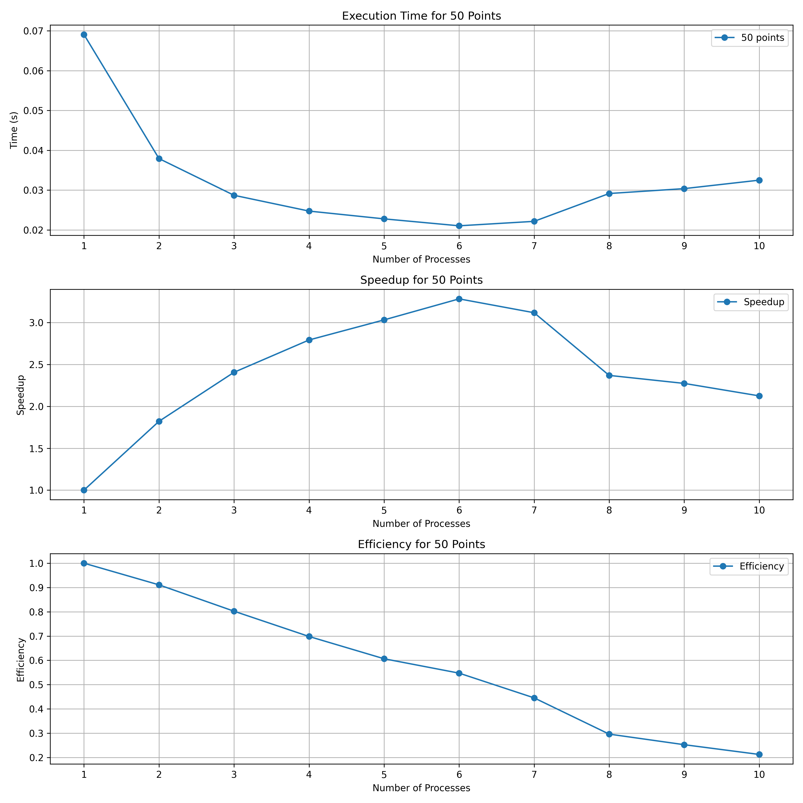
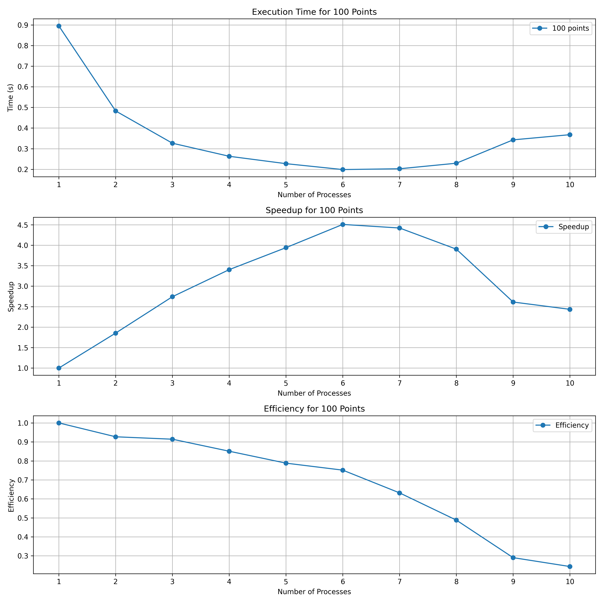
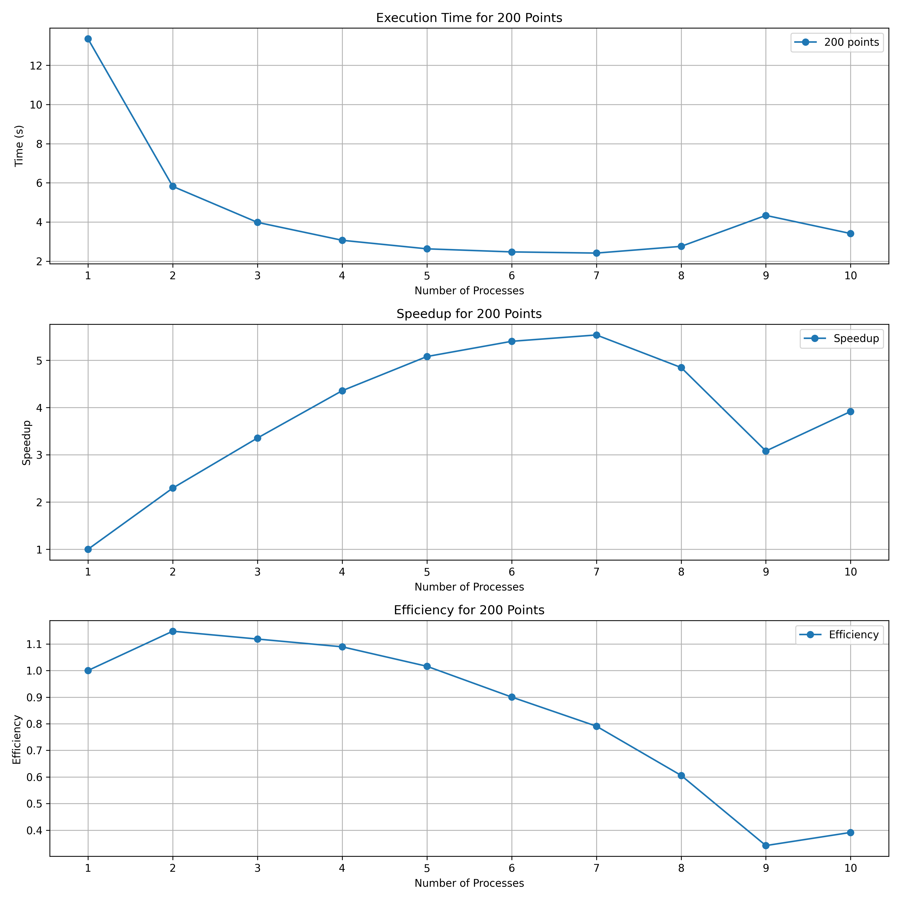
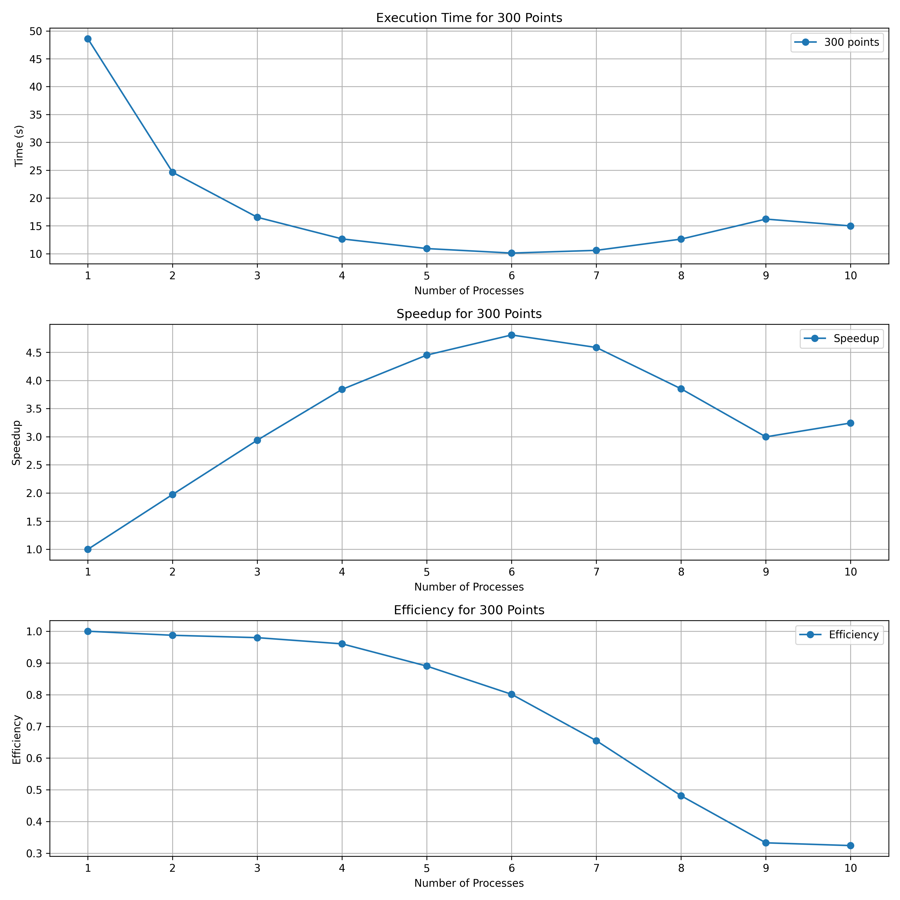

# Задание 2: Решение уравнения в частных производных

## Описание задания  

Реализован алгоритм решения уравнения Пуассона методом Гаусса-Зейделя с использованием OpenMP. Вычисления проводятся на прямоугольной сетке с разным числом точек и потоков.

## Численные эксперименты

Рассматриваемые размеры сетки:

- $50 \times 50$
- $100 \times 100$
- $200 \times 200$
- $300 \times 300$.  

Количество потоков: от 1 до 10.

## Основные метрики параллельной реализации

Для оценки эффективности параллельной реализации используются следующие метрики:

- **Ускорение (S)**:

  $`
  S = \frac{T_{\text{послед}}}{T_{\text{паралл}}}
  `$

- **Эффективность (E)**:

  $`
  E = \frac{S}{nthreads}
  `$

---

## Результаты замеров времени  

### 50x50

| Processes | Mean Time (s) | **S** | **E** |
|-----------|---------------|-------|-------|
| 1 | 0.069063 | 1.00 | 1.00 |
| 2 | 0.037913 | 1.82 | 0.91 |
| 3 | 0.028694 | 2.41 | 0.80 |
| 4 | 0.024728 | 2.79 | 0.70 |
| 5 | 0.022773 | 3.03 | 0.61 |
| 6 | 0.021031 | 3.28 | 0.55 |
| 7 | 0.022148 | 3.12 | 0.45 |
| 8 | 0.029141 | 2.37 | 0.30 |
| 9 | 0.030367 | 2.27 | 0.25 |
| 10 | 0.032494 | 2.13 | 0.21 |

---

### 100x100

| Processes | Mean Time (s) | **S** | **E** |
|-----------|---------------|-------|-------|
| 1 | 0.895330 | 1.00 | 1.00 |
| 2 | 0.482939 | 1.85 | 0.93 |
| 3 | 0.326451 | 2.74 | 0.91 |
| 4 | 0.263061 | 3.40 | 0.85 |
| 5 | 0.227221 | 3.94 | 0.79 |
| 6 | 0.198635 | 4.51 | 0.75 |
| 7 | 0.202556 | 4.42 | 0.63 |
| 8 | 0.229361 | 3.90 | 0.49 |
| 9 | 0.342733 | 2.61 | 0.29 |
| 10 | 0.367837 | 2.43 | 0.24 |

---

### 200x200

| Processes | Mean Time (s) | **S** | **E** |
|-----------|---------------|-------|-------|
| 1 | 13.356090 | 1.00 | 1.00 |
| 2 | 5.818821 | 2.30 | 1.15 |
| 3 | 3.981094 | 3.35 | 1.12 |
| 4 | 3.065788 | 4.36 | 1.09 |
| 5 | 2.629271 | 5.08 | 1.02 |
| 6 | 2.472400 | 5.40 | 0.90 |
| 7 | 2.412502 | 5.54 | 0.79 |
| 8 | 2.755362 | 4.85 | 0.61 |
| 9 | 4.335488 | 3.08 | 0.34 |
| 10 | 3.409820 | 3.92 | 0.39 |

---

### 300x300

| Processes | Mean Time (s) | **S** | **E** |
|-----------|---------------|-------|-------|
| 1 | 48.599827 | 1.00 | 1.00 |
| 2 | 24.614930 | 1.97 | 0.99 |
| 3 | 16.535677 | 2.94 | 0.98 |
| 4 | 12.653973 | 3.84 | 0.96 |
| 5 | 10.920889 | 4.45 | 0.89 |
| 6 | 10.111069 | 4.81 | 0.80 |
| 7 | 10.601157 | 4.58 | 0.65 |
| 8 | 12.622356 | 3.85 | 0.48 |
| 9 | 16.216249 | 3.00 | 0.33 |
| 10 | 14.985719 | 3.24 | 0.32 |

---

## Выводы по заданию 2  

1. **Ускорение (S):**  
   - Ускорение растёт с увеличением числа потоков, но для больших размеров сетки рост более выражен.  
   - Для малых размеров сетки ($50 \times 50$) прирост ускорения замедляется из-за накладных затрат на синхронизацию потоков.

2. **Эффективность (E):**  
   - Эффективность выше для больших сеток ($200 \times 200$ и $300 \times 300$), так как вычисления доминируют над накладными затратами.  
   - Для малых размеров сетки эффективность снижается с увеличением числа потоков.

3. **Общая тенденция:**  
   - Метод Гаусса-Зейделя эффективно масштабируется для больших размеров сеток, особенно при умеренном числе потоков.  
   - Для небольших размеров сеток число потоков следует ограничивать для минимизации накладных затрат.
