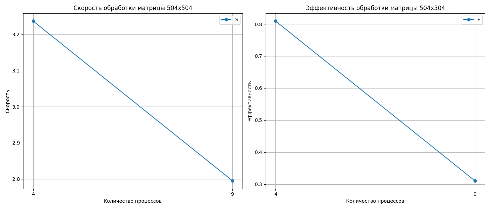
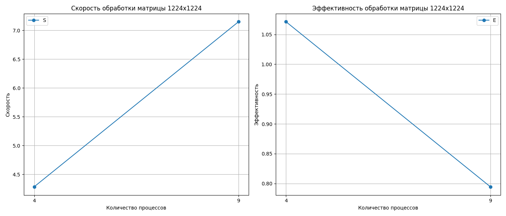
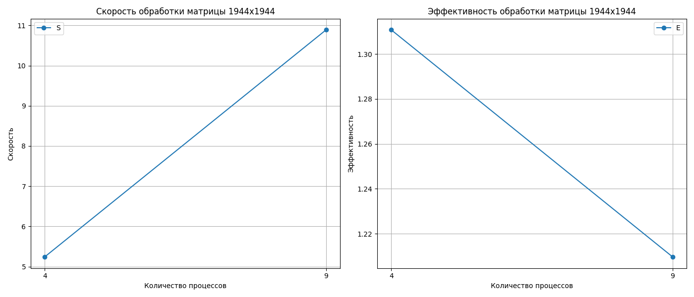
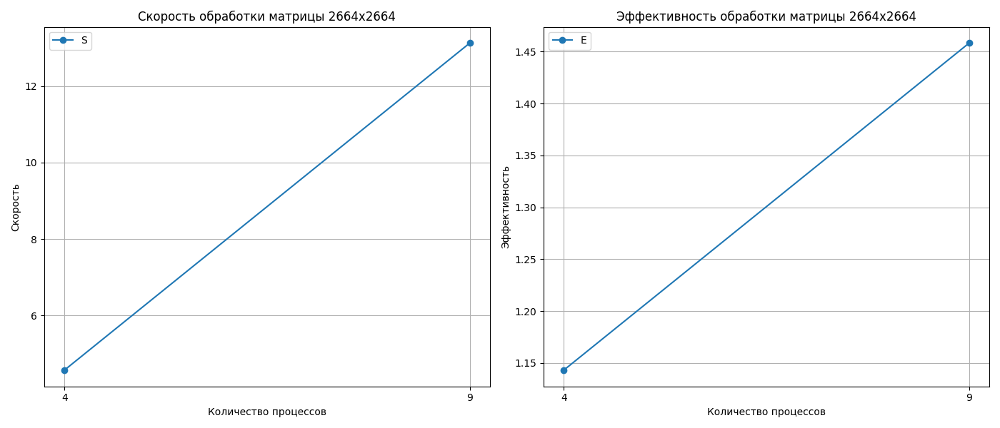

# Задание 2: Матричное умножение (алгоритм Кэннона)

## Описание задания  

Реализован алгоритм умножения двух квадратных матриц по алгоритму Кэннона с использованием MPI. Матрицы разбиваются на блоки, и вычисления выполняются в несколько этапов с обменом данных между процессами.

## Численные эксперименты

Рассматриваемые размеры матриц:  
- $504 \times 504$, $1244 \times 1224$, $1944 \times 1944$, $2664 \times 2664$.  

Количество процессов: 1, 4, 9 (число процессов должно быть полный квадратом).

## Основные метрики параллельной реализации

Для оценки эффективности параллельной реализации используются следующие метрики:

- **Ускорение (S)**:

  $`
  S = \frac{T_{\text{послед}}}{T_{\text{паралл}}}
  `$

- **Эффективность (E)**:

  $`
  E = \frac{S}{nthreads}
  `$

## Результаты замеров времени  

### 504x504

|  Размер матрицы **A**  |  Количество процессов **P**  |  **S**  |  **E**  |
| :---: | :---: | :---: | :---: |
|  504x504  |  1  |  -  |  -  |
|  504x504  |  4  |  3.2371  |  0.8093  |
|  504x504  |  9  |  2.795  |  0.3106  |

### 1224x1224

|  Размер матрицы **A**  |  Количество процессов **P**  |  **S**  |  **E**  |
| :---: | :---: | :---: | :---: |
|  1224x1224  |  1  |  -  |  -  |
|  1224x1224  |  4  |  4.2852  |  1.0713  |
|  1224x1224  |  9  |  7.1493  |  0.7944  |

### 1944x1944

|  Размер матрицы **A**  |  Количество процессов **P**  |  **S**  |  **E**  |
| :---: | :---: | :---: | :---: |
|  1944x1944  |  1  |  -  |  -  |
|  1944x1944  |  4  |  5.2426  |  1.3107  |
|  1944x1944  |  9  |  10.8877  |  1.2097  |

### 2664x2664

|  Размер матрицы **A**  |  Количество процессов **P**  |  **S**  |  **E**  |
| :---: | :---: | :---: | :---: |
|  2664x2664  |  1  |  -  |  -  |
|  2664x2664  |  4  |  4.5084  |  1.1271  |
|  2664x2664  |  9  |  11.4912  |  1.2768  |

## Выводы по заданию 2  
- Алгоритм Кэннона эффективно масштабируется при увеличении числа процессов на больших данных.  
- При малых данных и большом количестве процессов эффективность падает.
