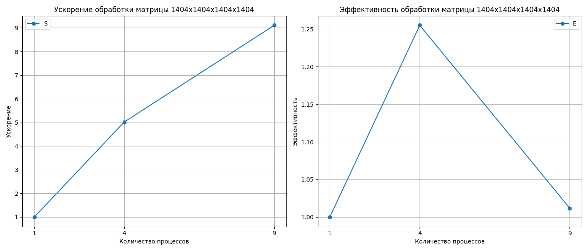
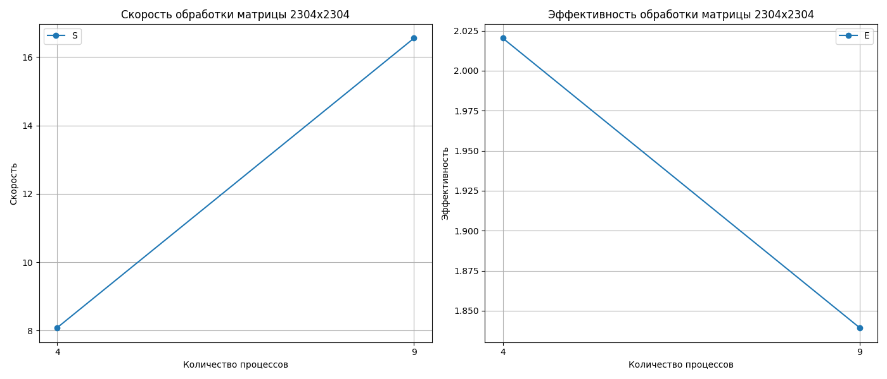

# Задание 2: Матричное умножение (алгоритм Кэннона)

## Описание задания  

Реализован алгоритм умножения двух квадратных матриц по алгоритму Кэннона с использованием MPI. Матрицы разбиваются на блоки, и вычисления выполняются в несколько этапов с обменом данных между процессами.

## Численные эксперименты

Рассматриваемые размеры матриц:

- $504 \times 504$
- $1404 \times 1404$
- $2304 \times 2304$.  

Количество процессов: 1, 4, 9 (число процессов должно быть полный квадратом).

## Основные метрики параллельной реализации

Для оценки эффективности параллельной реализации используются следующие метрики:

- **Ускорение (S)**:

  $`
  S = \frac{T_{\text{послед}}}{T_{\text{паралл}}}
  `$

- **Эффективность (E)**:

  $`
  E = \frac{S}{nthreads}
  `$

## Результаты замеров времени  

### 504x504

|  Размер матрицы **A**  |  Количество процессов **P**  |  **S**  |  **E**  |
| :---: | :---: | :---: | :---: |
|  504x504  |  1  |  -  |  -  |
|  504x504  |  4  |  3.8075  |  0.9519  |
|  504x504  |  9  |  5.9536  |  0.6615  |

### 1404x1404

|  Размер матрицы **A**  |  Количество процессов **P**  |  **S**  |  **E**  |
| :---: | :---: | :---: | :---: |
|  1404x1404  |  1  |  -  |  -  |
|  1404x1404  |  4  |  5.0196  |  1.2549  |
|  1404x1404  |  9  |  9.1061  |  1.0118  |

### 2304x2304

|  Размер матрицы **A**  |  Количество процессов **P**  |  **S**  |  **E**  |
| :---: | :---: | :---: | :---: |
|  2304x2304  |  1  |  -  |  -  |
|  2304x2304  |  4  |  8.3036  |  2.0759  |
|  2304x2304  |  9  |  13.7087  |  1.5232  |

## Выводы по заданию 2  

1. **Ускорение (S):**  
   - С увеличением числа процессов наблюдается значительное ускорение вычислений.  
   - Для малых матриц (504x504) прирост ускорения замедляется из-за высоких накладных затрат на коммуникацию.

2. **Эффективность (E):**  
   - Эффективность параллельной реализации выше для больших матриц (1404x1404 и 2304x2304), так как вычисления доминируют над затратами на обмен данными.  
   - Для малых матриц эффективность снижается с увеличением числа процессов из-за избыточного параллелизма.

3. **Общая тенденция:**  
   - Алгоритм Кэннона эффективно масштабируется на больших данных, особенно при достаточном числе процессов.  
   - Для малых размеров матриц следует выбирать меньшее число процессов, чтобы минимизировать накладные затраты.

