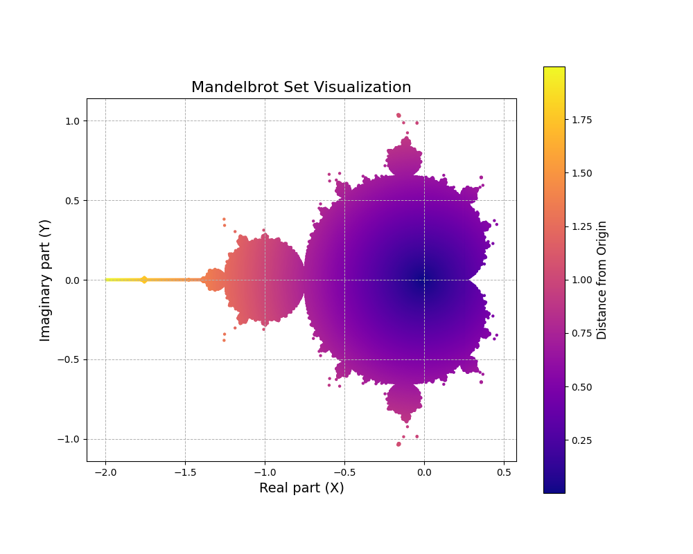

# Оценка множества Мандельброта с использованием многопоточности

Алгоритм для построения и оценки множества Мандельброта был реализован с использованием многопоточности через библиотеку `pthreads`.

## Описание алгоритма

Множество Мандельброта — это множество точек на комплексной плоскости, для которых последовательность, заданная рекуррентным соотношением $z_{n+1} = z_n^2 + c$, при $z_0 = 0$, не стремится к бесконечности.

**Алгоритм работы:**

1. **Определение области**: Задается прямоугольная область на комплексной плоскости с границами по осям x и y.

2. **Разбиение области на точки**: Область разбивается на сетку из `npoints` по обеим осям, всего получается $npoints \times npoints$ точек.

3. **Проверка принадлежности к множеству Мандельброта**:
   - Для каждой точки $c = x + yi$ из сетки проводится итерационный процесс.
   - Начальное значение $z_0 = 0$.
   - Итеративно вычисляется $z_{n+1} = z_n^2 + c$.
   - Если модуль $|z_n|$ превышает 2 или достигнуто максимальное число итераций (`max\_iter`), процесс останавливается.
   - Если процесс остановился из-за достижения `max_iter`, точка считается принадлежащей множеству Мандельброта.

4. **Сохранение результатов**: Координаты точек, принадлежащих множеству, записываются в файл `mandelbrot.csv`.

## Параллельная реализация

Для ускорения вычислений используется многопоточность:

- **Разделение работы**: Диапазон точек по оси x делится между потоками. Каждый поток обрабатывает свой участок сетки.

- **Потоковая функция `mandelbrot_thread`**: Каждый поток выполняет функцию, в которой:
  - Проводится вычисление для назначенного диапазона точек.
  - Принадлежащие множеству точки записываются в общий файл. Доступ к файлу синхронизируется с помощью мьютекса (`pthread_mutex_t`).

- **Синхронизация**: Используется мьютекс для предотвращения одновременной записи в файл из разных потоков.

## Измерение времени выполнения

Время выполнения программы измеряется с помощью функций замера времени до начала вычислений и после их окончания.

Общее время выполнения зависит от:

- **Числа потоков (`nthreads`)**: Увеличение числа потоков должно сокращать время выполнения до определенного предела.

- **Числа точек (`npoints`)**: Большее количество точек повышает детализацию изображения, но увеличивает время выполнения.

## Основные метрики параллельной реализации

Для оценки эффективности параллельной реализации используются следующие метрики:

- **Ускорение (S)**:

$`
S = \frac{T_{\text{послед}}}{T_{\text{паралл}}}
`$

- **Эффективность (E)**:

$`
E = \frac{S}{nthreads}
`$

## Результаты тестов

### Тест 1
* `npoints = 500`

| Количество потоков | Среднее время выполнения (`T_avg`), сек | Ускорение (`S`) | Эффективность (`E`) |
|--------------------|-----------------------------------------|-----------------|---------------------|
| 1 (последовательный алгоритм) | 0.435544 | -       | -       |
| 2  | 0.355772 | 1.2242 | 0.6121 |
| 8  | 0.114896 | 3.7907 | 0.4738 |
| 20 | 0.085240 | 5.1096 | 0.2554 |
| 64 | 0.080387 | 5.4180 | 0.0846 |

### Тест 2
* `npoints = 1000`

| Количество потоков | Среднее время выполнения (`T_avg`), сек | Ускорение (`S`) | Эффективность (`E`) |
|--------------------|-----------------------------------------|-----------------|---------------------|
| 1 (последовательный алгоритм) | 1.223574 | -       | -       |
| 2  | 0.906748 | 1.3494 | 0.6747 |
| 8  | 0.445877 | 2.7441 | 0.3430 |
| 20 | 0.330314 | 3.7042 | 0.1852 |
| 64 | 0.312655 | 3.9134 | 0.0611 |

### Тест 3
* `npoints = 2000`

| Количество потоков | Среднее время выполнения (`T_avg`), сек | Ускорение (`S`) | Эффективность (`E`) |
|--------------------|-----------------------------------------|-----------------|---------------------|
| 1 (последовательный алгоритм) | 5.030325 | -       | -       |
| 2  | 3.736414 | 1.3462 | 0.6731 |
| 8  | 1.886987 | 2.6657 | 0.3332 |
| 20 | 1.289589 | 3.9007 | 0.1950 |
| 64 | 1.521191 | 3.3068 | 0.0516 |

## Анализ результатов

Как и в первой задаче, использование многопоточности существенно снижает время выполнения. В этой задаче мы рассмотрели случай с 20 потоками вместо 16, чтобы сравнить результаты с оптимальным числом потоков (равным числу физических ядер) со случаями большего и меньшего числа потоков.
