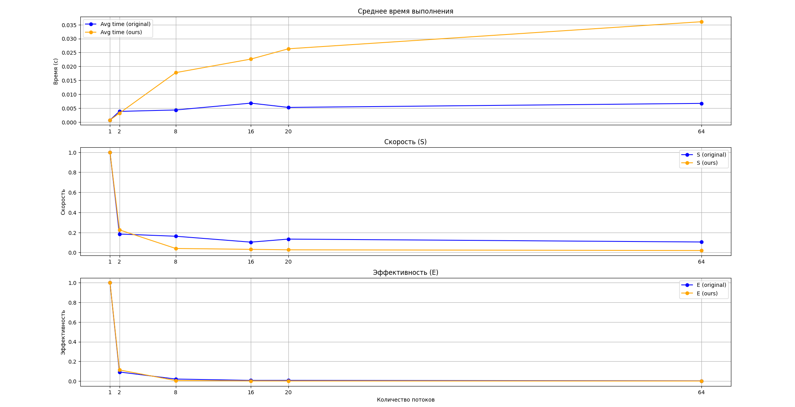
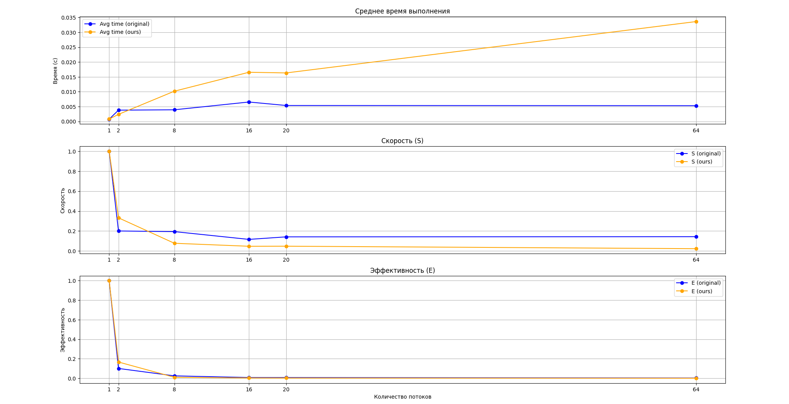

# Реализация read-write lock

## Описание алгоритма

Основной принцип работы `rwlock`:
- Когда поток получает блокировку чтения, то сколько угодно других
потоков могут также получить блокировку на чтение, но ни один поток
не получит блокировку на запись, пока все читающие потоки не вызовут
функцию unlock для данной переменной.
- Когда поток получает блокировку на запись, то ни один другой поток
не сможет получить блокировку ни на чтение, ни на запись

### Структура данных

`rwlock_t` — название структуры, реализующей `rwlock`.
- `lock` — мьютекс.
- `readers_cond` — условная переменная для блокировки/разблокировки потоков, ожидающих возможность _чтения_.
- `writers_cond` — условная переменная для блокировки/разблокировки потоков, ожидающих возможность _записи_.
- `readers` — количество потоков, ожидающих права на чтение.
- `writers` — флаг, показывающий, получил ли блокировку хотя бы один писатель в данный момент.
- `waiting_writers` — количество потоков, ожидающих права на запись.

### Описание работы функций

1. **`rwlock_init`** — инициализация блокировки:
    - Инициализируются мьютекс и условные переменные.
    - Счетчики `readers`, `writers` и `waiting_writers` устанавливаются в 0.

2. **`rwlock_rdlock`** — блокировка для чтения:
    - Поток лочит мьютекс.
    - Если идет запись (`writers > 0`) или есть ожидающие писатели (`waiting_writers > 0`), поток ждет, пока не станет возможным чтение.
    - После того как чтение разрешено, счетчик `readers` увеличивается, и мьютекс освобождается.

3. **`rwlock_wrlock`** — блокировка для записи:
    - Поток лочит мьютекс.
    - Увеличивается счетчик ожидающих писателей (`waiting_writers`).
    - Поток ждет, пока другие писатели или читатели не завершат свою работу.
    - После этого счетчик ожидающих писателей уменьшается, а счетчик писателей (`writers`) увеличивается, сигнализируя о том, что запись началась.
    - Мьютекс освобождается.

4. **`rwlock_unlock`** — снятие блокировки:
    - Поток лочит мьютекс.
    - Если был писатель, счетчик `writers` уменьшается.
    - Иначе если был читатель, счетчик `readers` уменьшается.
    - Если писателей больше нет и есть ожидающие писатели, активируется один из ожидающих писателей с помощью `pthread_cond_signal`. В противном случае, если нет читателей и писателей, активируются все ожидающие читатели с помощью `pthread_cond_broadcast`.
    - Мьютекс освобождается.

5. **`rwlock_destroy`** — уничтожение блокировки:
    - Освобождаются ресурсы, связанные с мьютексом и условными переменными.
  
_Важное замечание!_

Для обеспечения корректной работы программы функцию `pthread_cond_wait` нужно вызывать внутри цикла `while`. Делается это ради следующих целей:
- Обезопасить потоки от спурриозных пробуждений (spurious wakeup), т.е. от случайных пробуждений потоков.
- Защита от состояния гонки (race condition), когда потоки перехватывают друг у друга права на запись/чтение при заданных условиях. Например, если во время работы одного потока другой поток изменит переменные `readers` и `writers`, то первый может сработать некорретно.

## Оценка времени работы

1. **`rwlock_init`** — Время работы O(1).

2. **`rwlock_rdlock`** — Если нет активных писателей или ожидающих писателей, то выполняется за O(1), иначе время неопределено.

3. **`rwlock_wrlock`** — Если нет активных писателей или читателей, то выполняется за O(1), иначе время неопределено.

4. **`rwlock_unlock`** — Если нет ожидания других потоков, то выполняется за O(1), иначе время не определено.

5. **`rwlock_destroy`** — Время работы O(1).

## Измерение времени выполнения

Время выполнения программы измеряется с помощью функций замера времени до начала вычислений и после их окончания. 

Общее время выполнения зависит от следующих факторов:
- **Число потоков (`nthreads`)**: увеличение количества потоков должно сокращать время выполнения до определённого предела.
- **Число ключей для односвязного списка (`num_of_keys`)**: увеличение числа ключей увеличивает время каждой операции (поиска, вставки, удаления).
- **Число операций над списком (`num_of_ops`)**: увеличение числа операций увеличивает время работы программы.
- **Вероятность поиска (`search_rate`)**: чем выше вероятность, тем чаще будут происходить операции поиска, время исполнения которых зависит от числа ключей в данный момент времени.
- **Вероятность вставки (`insert_rate`)**: чем выше вероятность, тем чаще будут происходить операции вставки, время исполнения которых зависит от числа ключей в данный момент времени.
- **Вероятность удаление (`drop_rate`)** (скрытое): чем выше вероятность, тем чаще будут происходить операции удаления, время исполнения которых зависит от числа ключей в данный момент времени.

## Основные метрики параллельной реализации

Для оценки эффективности параллельной реализации используются следующие метрики:

- **Ускорение (S)**:

  $`
  S = \frac{T_{\text{послед}}}{T_{\text{паралл}}}
  `$

- **Эффективность (E)**:

  $`
  E = \frac{S}{nthreads}
  `$

## Результаты тестов

### Тест 1
* `num_of_keys = 1024`
* `num_of_ops = 1024`
* `search_rate = 0.3`
* `insert_rate = 0.2`
* `drop_rate = 0.5`

* Файл `pth_ll_rwl.c`

| Количество потоков | Среднее время выполнения (`T_avg`), сек | Ускорение (`S`) | Эффективность (`E`) |
|--------------------|-----------------------------------------|-----------------|---------------------|
| 1 (последовательный алгоритм) | 0.000702 | - | - |
| 2  | 0.003813 | 0.1841 | 0.0921 |
| 8  | 0.004324 | 0.1623 | 0.0203 |
| 16 | 0.006784 | 0.1034 | 0.0065 |
| 20 | 0.005247 | 0.1338 | 0.0067 |
| 64 | 0.006694 | 0.1049 | 0.0016 |

* Файл `ppt_ll_rwl.c`

| Количество потоков | Среднее время выполнения (`T_avg`), сек | Ускорение (`S`) | Эффективность (`E`) |
|--------------------|-----------------------------------------|-----------------|---------------------|
| 1 (последовательный алгоритм) | 0.000716 | - | - |
| 2  | 0.003168 | 0.2259 | 0.1129 |
| 8  | 0.017757 | 0.0403 | 0.005 |
| 16 | 0.022629 | 0.0316 | 0.002 |
| 20 | 0.026335 | 0.0272 | 0.0014 |
| 64 | 0.036073 | 0.0198 | 0.0003 |

### Тест 2
* `num_of_keys = 2024`
* `num_of_ops = 555`
* `search_rate = 0.3`
* `insert_rate = 0.2`
* `drop_rate = 0.5`

* Файл `pth_ll_rwl.c`

| Количество потоков | Среднее время выполнения (`T_avg`), сек | Ускорение (`S`) | Эффективность (`E`) |
|--------------------|-----------------------------------------|-----------------|---------------------|
| 1 (последовательный алгоритм) | 0.001167 | - | - |
| 2  | 0.005868 | 0.1989 | 0.0994 |
| 8  | 0.004477 | 0.2607 | 0.0326 |
| 16 | 0.004780 | 0.2442 | 0.0153 |
| 20 | 0.004804 | 0.243 | 0.0121 |
| 64 | 0.005329 | 0.219 | 0.0034 |

* Файл `ppt_ll_rwl.c`

| Количество потоков | Среднее время выполнения (`T_avg`), сек | Ускорение (`S`) | Эффективность (`E`) |
|--------------------|-----------------------------------------|-----------------|---------------------|
| 1 (последовательный алгоритм) | 0.001179 | - | - |
| 2  | 0.003435 | 0.3433 | 0.1716 |
| 8  | 0.009417 | 0.1252 | 0.0157 |
| 16 | 0.012533 | 0.0941 | 0.0059 |
| 20 | 0.013432 | 0.0878 | 0.0044 |
| 64 | 0.019685 | 0.0599 | 0.0009 |

### Тест 3
* `num_of_keys = 555`
* `num_of_ops = 2024`
* `search_rate = 0.3`
* `insert_rate = 0.2`
* `drop_rate = 0.5`

* Файл `pth_ll_rwl.c`

| Количество потоков | Среднее время выполнения (`T_avg`), сек | Ускорение (`S`) | Эффективность (`E`) |
|--------------------|-----------------------------------------|-----------------|---------------------|
| 1 (последовательный алгоритм) | 0.000900 | - | - |
| 2  | 0.004974 | 0.1809 | 0.0905 |
| 8  | 0.005661 | 0.1589 | 0.0199 |
| 16 | 0.006935 | 0.1297 | 0.0081 |
| 20 | 0.009978 | 0.0902 | 0.0045 |
| 64 | 0.011785 | 0.0763 | 0.0012 |

* Файл `ppt_ll_rwl.c`

| Количество потоков | Среднее время выполнения (`T_avg`), сек | Ускорение (`S`) | Эффективность (`E`) |
|--------------------|-----------------------------------------|-----------------|---------------------|
| 1 (последовательный алгоритм) | 0.000883 | - | - |
| 2  | 0.004170 | 0.2117 | 0.1058 |
| 8  | 0.031900 | 0.0277 | 0.0035 |
| 16 | 0.046181 | 0.0191 | 0.0012 |
| 20 | 0.052516 | 0.0168 | 0.0008 |
| 64 | 0.076733 | 0.0115 | 0.0002 |

### Тест 4
* `num_of_keys = 1024`
* `num_of_ops = 1024`
* `search_rate = 0.5`
* `insert_rate = 0.4`
* `drop_rate = 0.1`

* Файл `pth_ll_rwl.c`

| Количество потоков | Среднее время выполнения (`T_avg`), сек | Ускорение (`S`) | Эффективность (`E`) |
|--------------------|-----------------------------------------|-----------------|---------------------|
| 1 (последовательный алгоритм) | 0.000825 | - | - |
| 2  | 0.007253 | 0.1138 | 0.0569 |
| 8  | 0.005591 | 0.1476 | 0.0185 |
| 16 | 0.006258 | 0.1319 | 0.0082 |
| 20 | 0.006656 | 0.124 | 0.0062 |
| 64 | 0.009600 | 0.086 | 0.0013 |

* Файл `ppt_ll_rwl.c`

| Количество потоков | Среднее время выполнения (`T_avg`), сек | Ускорение (`S`) | Эффективность (`E`) |
|--------------------|-----------------------------------------|-----------------|---------------------|
| 1 (последовательный алгоритм) | 0.000893 | - | - |
| 2  | 0.003644 | 0.245 | 0.1225 |
| 8  | 0.015900 | 0.0561 | 0.007 |
| 16 | 0.024881 | 0.0359 | 0.0022 |
| 20 | 0.026952 | 0.0331 | 0.0017 |
| 64 | 0.044912 | 0.0199 | 0.0003 |

### Тест 5
* `num_of_keys = 1024`
* `num_of_ops = 1024`
* `search_rate = 0.8`
* `insert_rate = 0.1`
* `drop_rate = 0.1`

* Файл `pth_ll_rwl.c`

| Количество потоков | Среднее время выполнения (`T_avg`), сек | Ускорение (`S`) | Эффективность (`E`) |
|--------------------|-----------------------------------------|-----------------|---------------------|
| 1 (последовательный алгоритм) | 0.000761 | - | - |
| 2  | 0.003793 | 0.2006 | 0.1003 |
| 8  | 0.003918 | 0.1942 | 0.0243 |
| 16 | 0.006536 | 0.1164 | 0.0073 |
| 20 | 0.005362 | 0.1419 | 0.0071 |
| 64 | 0.005301 | 0.1435 | 0.0022 |

* Файл `ppt_ll_rwl.c`

| Количество потоков | Среднее время выполнения (`T_avg`), сек | Ускорение (`S`) | Эффективность (`E`) |
|--------------------|-----------------------------------------|-----------------|---------------------|
| 1 (последовательный алгоритм) | 0.000790 | - | - |
| 2  | 0.002378 | 0.3322 | 0.1661 |
| 8  | 0.010180 | 0.0776 | 0.0097 |
| 16 | 0.016550 | 0.0477 | 0.003 |
| 20 | 0.016325 | 0.0484 | 0.0024 |
| 64 | 0.033620 | 0.0235 | 0.0004 |

### Тест 6
* `num_of_keys = 1024`
* `num_of_ops = 1024`
* `search_rate = 0.1`
* `insert_rate = 0.1`
* `drop_rate = 0.8`

* Файл `pth_ll_rwl.c`

| Количество потоков | Среднее время выполнения (`T_avg`), сек | Ускорение (`S`) | Эффективность (`E`) |
|--------------------|-----------------------------------------|-----------------|---------------------|
| 1 (последовательный алгоритм) | 0.000567 | - | - |
| 2  | 0.002521 | 0.2247 | 0.1124 |
| 8  | 0.003079 | 0.184 | 0.023 |
| 16 | 0.003556 | 0.1593 | 0.01 |
| 20 | 0.003776 | 0.15 | 0.0075 |
| 64 | 0.004269 | 0.1327 | 0.0021 |

* Файл `ppt_ll_rwl.c`

| Количество потоков | Среднее время выполнения (`T_avg`), сек | Ускорение (`S`) | Эффективность (`E`) |
|--------------------|-----------------------------------------|-----------------|---------------------|
| 1 (последовательный алгоритм) | 0.000572 | - | - |
| 2  | 0.002701 | 0.2116 | 0.1058 |
| 8  | 0.012114 | 0.0472 | 0.0059 |
| 16 | 0.015095 | 0.0379 | 0.0024 |
| 20 | 0.019231 | 0.0297 | 0.0015 |
| 64 | 0.020761 | 0.0275 | 0.0004 |

Файлы со статистической информацией по времени выполнения находятся в `.csv`-файлах: `{file name without .c}/benchmarks_{num_of_keys}_{num_of_ops}_{search_rate}_{insert_rate}/execution_times_{n}_threads.csv`.

## Анализ результатов

В целом, результаты тестов библиотеки pthreads вышли немного лучше, чем тесты самописной реализации. Это может быть связано с тем, что текущая реализация использовала очень много ожиданий разрешения на операцию с залоченным мьютексом, из-за чего при увеличении числа потоков общее время ожидания могло расти. Чтобы этого избежать, нужно выбрать совершенно другую модель реализации, в которой время на ожидание либо будет меньше, либо будет отсутствовать и заменится более эффективной по времени операцией.

Исходя из тестов, увеличение числа ключей больше влияет на производительность, чем увеличение числа операций.

Также на тестах видно, что самая "дешёвая" операция -- это поиск. При увеличении вероятности поиска скорость работы программы становится кратно быстрее, чем при увеличении вероятности удаления или вставки.
